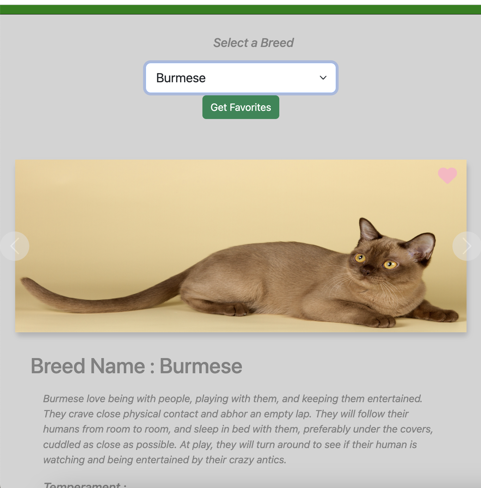

# Working with External Data

## Objectives

- Request data from an external API using fetch and Axios.
- Create an interactive, dynamic webpage that serves content from an external API.
- Use async/await and Promises to create synchronous logic in asynchronous actions.
- Using fetch or Axios, POST data to and DELETE data from an external API.

## Technologies Used

- HTML
- CSS
- Javascript

## Features

- Used fetch and axios to get data from the cat api.
- Display all the cat breed list in dropdown.
- Display the images in carousel from cat api.
- Update Details o cat in div (info dump).
- Using interceptors from axios to show progress bar, execution time and change the cursor.
- Allows to favourite a cat and display list on click of button.
- Provide delete functionality to delets favourite cat.

## Output

